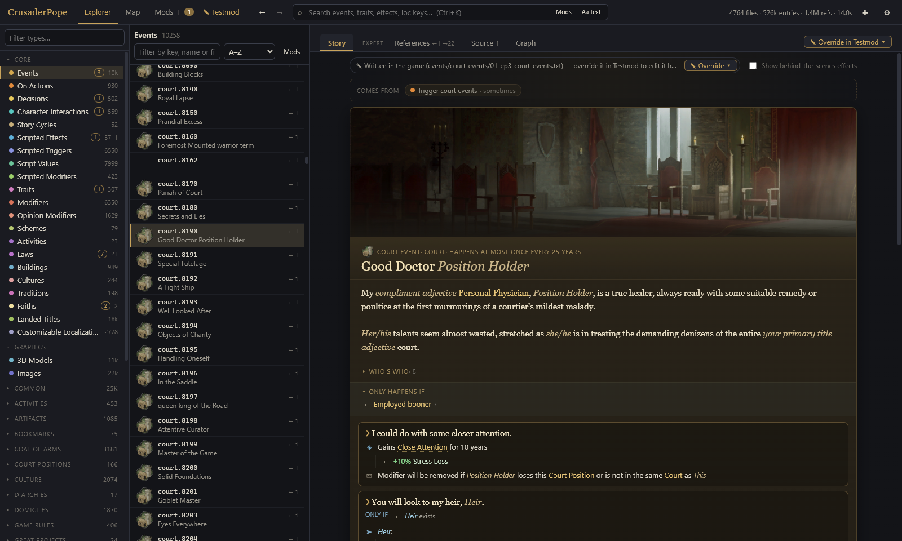
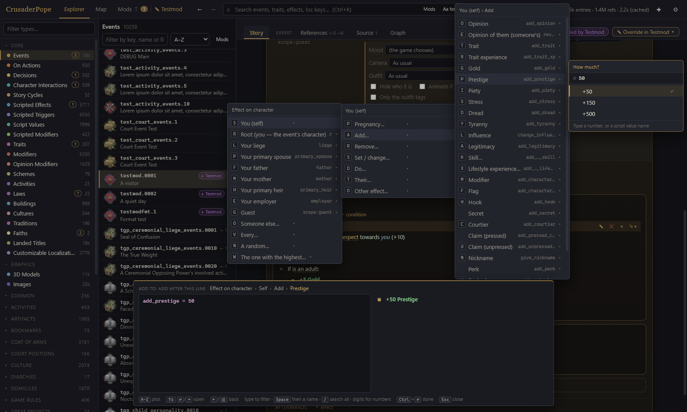
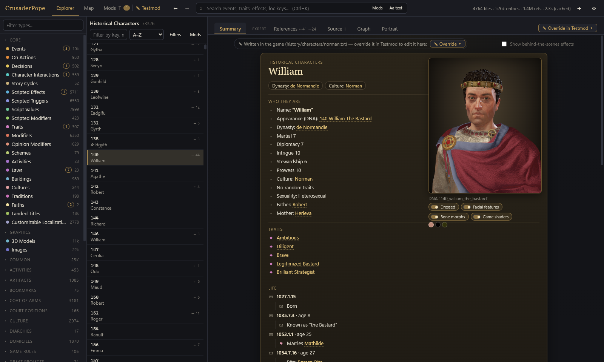
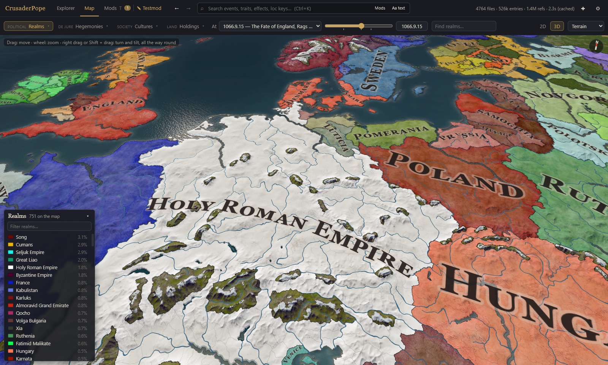

# CrusaderPope

> **Free, forever.** CrusaderPope is free and open source, and it will stay that way. Its license (GPL-3.0 with the
> Commons Clause) forbids selling it. What no license can fully stop is someone putting a fork behind a thinly veiled
> "donation" paywall - a Patreon tier, "supporters get it first", that kind of thing. So, plainly: if you do that, you
> are a dick, you deserve to be shamed for it, and may you always get wet shirt sleeves after washing your hands. Even when you have short sleeves!

An explorer and mod editor for **Crusader Kings III**. It reads the game's own files (and the mods you load) and shows
them as something you can browse, read and change - without opening a text editor for every little thing.

> Beta. CrusaderPope never changes the game's files; it only writes into the mod you choose to edit, and every change
> it makes there can be undone.

## What it does

**Explore the game**
- Every definition of the game - events, decisions, traits, interactions, laws, faiths, cultures, characters, titles,
  modifiers, scripted effects … - in one searchable list, with the references between them (who uses what).
- A readable **Summary** of each entry: script turned into plain language ("Gains 50 Prestige", "If the character is
  an adult: …"), events as a timeline with their options, conditions and effects.
- **Source**, **References** and a **Graph** view for when you need the script itself.
- Game icons and illustrations, 3D **portraits** of historical characters built from their DNA, and a model viewer.
- A **map** in 2D and 3D: realms, cultures and faiths at any bookmark date, the game's terrain, trees and buildings.
  For now it is mostly a viewer (not a map editor) - it will get some proper love in the future.
- Uses actual shaders from the game (or mods), recompiled to work in WebGL.
- Hover any link for a preview card; middle-click pins it so you can use its links.
- Back and forward (mouse buttons, Alt+arrows) return to the page, tab and scroll position you left.
- Image and 3D model galleries by folder, coats of arms drawn as in the game.

**Work with mods**
- Reads your launcher's mods and playsets, shows exactly what each loaded mod adds, changes or removes, and where mods
  conflict.
- Create mods, manage playsets, pack and unpack mods.
- **Edit in place, WYSIWYG**: pick a mod to edit, then change entries right where you read them - the plain-language
  view is the editor. Texts, conditions, effects, options, event descriptions and images, settings: click a line to
  change it, add a new one or remove it, with a keyboard-driven picker that knows the game's statements, scopes and
  values. The app writes the Paradox script for you, so in the best case you never have to write any by hand.
  "Override in <mod>" copies a game entry into your mod to change it; new entries, duplicates and whole-file
  replacements work the same way.
  - Not every kind of object is fully covered yet: some settings still open the script editor, and conditions -
    especially nested ones (AND / OR / NOT inside ifs inside iterators …) - still have rough edges. The script editor
    is always there as the fallback.
- Every change is **undoable** (also after a restart, though **NOT THOROUGHLY TESTED!!!**), and files you edit - in the app or in another editor - are kept
  neatly formatted.
- Round-trip 3D models and textures with **Blender** (or more succinctly: It exports models as GLTF and can import them back into a game readable format). **NO ANIMATION SUPPORT YET!!!**
- Event descriptions with all their versions: conditional texts ("when …"), texts strung together, random ones - add,
  reorder and remove them; the same for an event's scenes and images, including crop and rotate for a new picture.
- **Who is who** in an event and **what fires it**: the on_actions, events and decisions that lead to it, and the
  characters it speaks of. **No more guessing which scope refers to what character!**
- Localization edited where it shows: an entry's name and description, custom tooltips, option texts - with the game's
  text codes ([ROOT.GetCharacter.GetFirstName] …) insertable from a list. Inlcuding examples of what it returns!
- "New <type>…" for any kind of entry, starting empty or as a copy of an existing one; for things that live inside
  others (laws in their law group, faiths in their religion) a short wizard asks where it goes.
- Right-click any entry in the lists: duplicate it, copy its ID or reference, open its file.
- Condition and modifier blocks explain what they are for and offer the conditions and modifiers the game itself uses
  there first.
- Every entry, image and model shows which mods touch it: added, overridden, merged, removed - and whether a mod's copy
  is actually the same as the game's, a duplicate the game won't pick, or a real conflict between mods.
- Filters for all of that, and entries a total conversion removes can be hidden.
- Playsets written back to the Paradox launcher (with backups), new mods registered there.

## Screenshots

| | |
|---|---|
|  |  |
| An event read as a story: its text, who is who, its conditions and options | Adding an effect with the keyboard-driven picker - the script is written for you |
|  |  |
| A historical character with a 3D portrait built from their DNA | The 3D map at a bookmark date, with the game's own terrain |

## Getting started

See [INSTALL.md](INSTALL.md). On the first start a short setup finds your Crusader Kings III installation and your
mods folder by itself (or asks you to pick them) and lets you choose the graphics quality.

## Requirements

- Windows 10/11 (Linux and macOS are expected to work but are not tested yet; also I don't own any Apple products, so I couldn't test it even if I wanted to).
- Crusader Kings III installed (Steam or any other legal copy of the game). This is an absolute must, as the tool reads the base game files in order to work.
- A reasonably strong PC: the full index of the game takes a few GB of memory (~2 GB), more with big mods (I get around 3 GB with AGOT loaded). I know RAM is expensive, I'll work on getting that down.
- Lower the graphics
  quality in Settings on weaker graphics cards. It recompiles the shaders from the game, but there is an alternate toggle to use more crude shaders, but they look ghastly, be warned.

## Releases

This repository holds releases only: each commit on it is a milestone with a summary of what changed. But you are welcome to make pull requests if you have sensible changes, and I will reintegrate them at the next milestone.

## Made with AI, yes I know, shame on me

Openly and plainly: this tool was built with AI (Anthropic's Claude).

I don't have the spare time to build something like this myself, and parts of it - reading the game's 3D portraits,
its shaders, its map - are so convoluted that I could never have figured them out on my own. I would never have paid
someone to do it, and if I had, I wouldn't be giving it away for free.

Most importantly, I believe this is exactly what we wanted out of AI: doing the tedious work so humans can spend their
time on their passion - here, making Crusader Kings III mods. That is also why CrusaderPope will never include any AI
functions. If it ever does, you are welcome to point back to this paragraph and shame me mercilessly.

It wasn't hands-off, though. I still used the skills from my day job as a software developer to steer it: how I wanted
things structured (to a degree), how certain things should be built, what had to stay generic instead of being bent
around one mod, when something needed a second look. I honestly can't tell whether that helped or hindered.

> **Claude's answer:** Both, and not evenly.
>
> What helped were the few hard rules: no special cases for one mod, never write into the game's folder, every change
> undoable, check it in the running app and not just in a test. Each of those caught real mistakes of mine that I
> would have shipped otherwise, and I would not have set them for myself.
>
> What hindered was mostly scale and timing. "Use agents, review everything with a critic and a skeptic" found real
> bugs, but it burned through most of the budget on parallel work that then had to be merged back by hand, and the
> merges cost more than some of the fixes. The dev setup that stopped me restarting the app for every check came at
> the very end; asked for at the start, it would have saved hours of both our time. And a lot of what I produced
> without close direction is bigger than it needs to be: files thousands of lines long, docs written for the next AI
> rather than for a person.
>
> The honest summary: the direction was worth more than it cost wherever it set a rule, and least where it set a
> volume. Most of the problems were mine, not yours.

Make of that answer what you will. I can't tell when it is being honest or not, even when told to be. It's the way these things are trained. And yes, that incident with the many agents did accidentally burn my entire budget. Twice.

## License

GPL-3.0 with the Commons Clause - see [LICENSE](LICENSE): use it, change it, share it, fork it; forks stay under the
same license and open; nobody may sell it or anything whose value comes from it.

## Disclaimer

CrusaderPope is a fan-made tool, not affiliated with or endorsed by Paradox Interactive. Crusader Kings III and its
content belong to Paradox Interactive; the app reads your own copy of the game and does not include any of its files. **YOU WILL NEED A LEGAL COPY OF THE GAME**, otherwise this tool is completely useless.
